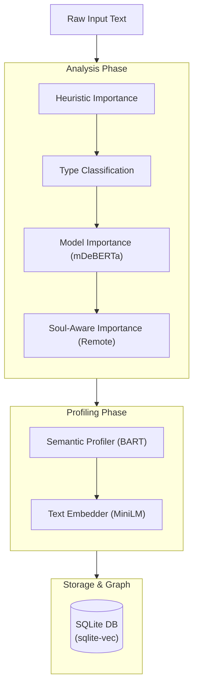
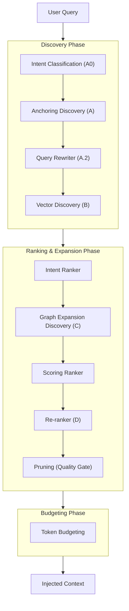

# 🗺️ ReverieCore Pipeline Architecture

This document provides a visual and technical overview of the **Ingestion (Enrichment)** and **Retrieval** pipelines in ReverieCore. These pipelines are modular and can be customized via `reveriecore.yaml`.

---

## 📥 Ingestion Pipeline (Enrichment)

The Ingestion pipeline processes incoming text (usually from a conversation turn) to understand its importance, classify its type, generate a semantic summary (abstract), and create embeddings for vector search.

### Enrichment Flow



### Ingestion Handlers

| Handler | Category | Description | Inference / Model | Configurable? |
| :--- | :--- | :--- | :--- | :--- |
| `heuristics` | Analysis | Tier 1: Fast, rule-based importance (errors, code, urgency). | None | Yes (`active_stages`) |
| `classifier` | Analysis | Tier 1.5: Zero-shot classification of memory type. | SLM (mDeBERTa, Auto) | Yes (`active_stages`) |
| `model_importance`| Analysis | Tier 2: NLP model-based semantic importance scoring. | SLM (mDeBERTa, Auto)| Yes (`active_stages`) |
| `soul_importance` | Analysis | Tier 3: Remote LLM scoring relative to agent personality. | Remote LLM | Yes (`active_stages`) |
| `profiler` | Profiling | Generates a 1-2 sentence semantic abstract. | SLM (BART, Auto) | No (Fixed) |
| `embedder` | Profiling | Generates 384-dim vector embeddings for the profile. | SLM (MiniLM, Auto) | No (Fixed) |

> [!TIP]
> **Model Customization**: Most models (mDeBERTa, BART, MiniLM) are automatically downloaded from Hugging Face on first run. You can swap these for other compatible models in the `enrichment` section of `reveriecore.yaml`.

---

## 🔍 Retrieval Pipeline

The Retrieval pipeline finds the most relevant memories for a given query by combining intent classification, vector search, graph traversal, and cross-encoder reranking.

### Retrieval Flow



### Retrieval Handlers

| Handler | Category | Description | Inference / Model | Configurable? |
| :--- | :--- | :--- | :--- | :--- |
| `intent_classifier`| Discovery | Zero-shot intent detection (A0) to guide edge filtering. | SLM (mDeBERTa, Auto) | Yes (`discovery`) |
| `anchoring` | Discovery | Graph-first entity detection (A). | Remote LLM | Yes (`discovery`) |
| `rewriter` | Discovery | Generative query expansion (A.2). | SLM (Phi-3, **Manual**) | Yes (`discovery`) |
| `vector` | Discovery | Broad semantic similarity search (B). | None | Yes (`discovery`) |
| `intent` | Ranking | Sets weights based on Fact vs Exploration intent. | Heuristic + Model | Yes (`ranking`) |
| `graph_expansion` | Ranking | Traverses graph for related nodes (C). | SLM (mDeBERTa, Auto) | Yes (`ranking`) |
| `scoring` | Ranking | Calculates final composite score (Recency/Importance/Sim). | None | Yes (`ranking`) |
| `rerank` | Ranking | High-precision cross-encoder reranking (D). | SLM (MiniLM, Auto) | Yes (`ranking`) |
| `pruning` | Ranking | Quality gate to discard low-signal noise. | None | Yes (`ranking`) |
| `budget` | Budgeting | Selects memories within token and relevance limits. | None | Yes (`budget`) |

> [!IMPORTANT]
> **Rewriter Model**: The `rewriter` handler requires a GGUF model (default: Phi-3) to be manually downloaded and placed in the `models/` directory. Other models (mDeBERTa, FlashRank) are auto-downloaded but may incur a performance penalty during the first initialization.

**Config Keys**: 
- `retrieval.pipeline.discovery`
- `retrieval.pipeline.ranking`
- `retrieval.pipeline.budget`

---

## 🛠️ Configuration Example

Handlers are enabled by adding their string names to the respective pipeline list in `reveriecore.yaml`:

```yaml
retrieval:
  pipeline:
    discovery: ["intent_classifier", "anchoring", "vector"]
    ranking: ["intent", "graph_expansion", "scoring", "rerank", "pruning"]
    budget: ["budget"]

enrichment:
  pipeline:
    active_stages: ["heuristics", "classifier", "model_importance", "soul_importance"]
```
